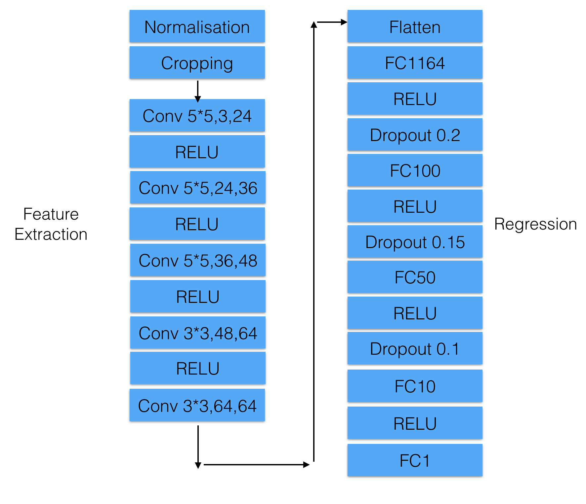
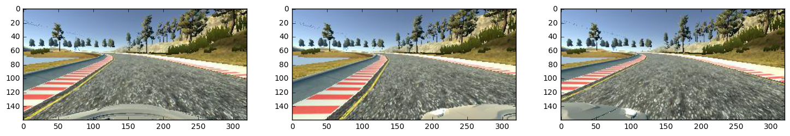
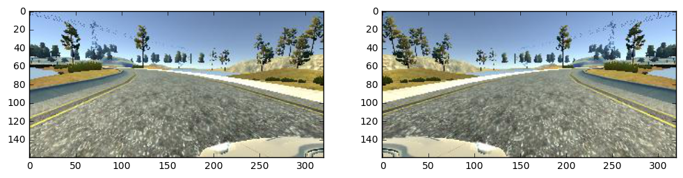

#**Behavioral Cloning** 

##Writeup Template

###You can use this file as a template for your writeup if you want to submit it as a markdown file, but feel free to use some other method and submit a pdf if you prefer.

---

**Behavioral Cloning Project**

The goals / steps of this project are the following:
* Use the simulator to collect data of good driving behavior
* Build, a convolution neural network in Keras that predicts steering angles from images
* Train and validate the model with a training and validation set
* Test that the model successfully drives around track one without leaving the road
* Summarize the results with a written report

## Rubric Points
###Here I will consider the [rubric points](https://review.udacity.com/#!/rubrics/432/view) individually and describe how I addressed each point in my implementation.  

---
###Files Submitted & Code Quality

####1. Submission includes all required files and can be used to run the simulator in autonomous mode

My project includes the following files:
* model.py containing the script to create and train the model
* drive.py for driving the car in autonomous mode
* model.h5 containing a trained convolution neural network 
* writeup_report.md or writeup_report.pdf summarizing the results
* video.mp4 for the recording of driving the car in autonomous mode 

####2. Submission includes functional code
Using the Udacity provided simulator and my drive.py file, the car can be driven autonomously around the track by executing 
```sh
python drive.py model.h5
```

####3. Submission code is usable and readable

The model.py file contains the code for training and saving the convolution neural network. The file shows the pipeline I used for training and validating the model, and it contains comments to explain how the code works.

###Model Architecture and Training Strategy

####1. An appropriate model architecture has been employed

My model uses the Nvidia neural network structure. It consists of 1 normalizaiton layer, 5 convolution layers and three fully connected layers.

The data is normalized in the model using a Keras lambda layer (**code line 100**), the model includes RELU layers to introduce nonlinearity (**code line 103**).

####2. Attempts to reduce overfitting in the model

The model contains dropout layers in order to reduce overfitting (model.py lines 111). 

The model was trained and validated on different data sets to ensure that the model was not overfitting (code line 22). The model was tested by running it through the simulator and ensuring that the vehicle could stay on the track.

####3. Model parameter tuning

The model used an adam optimizer, so the learning rate was not tuned manually (model.py line 126).

####4. Appropriate training data

The training data used is from Udacity. Training data was chosen to keep the vehicle driving on the road. I used a combination of center lane driving, recovering from the left and right sides of the road with correction of the steering angle. Images are flipped to augment the training dataset.

For details about how I created the training data, see the next section. 

###Model Architecture and Training Strategy

####1. Solution Design Approach

The overall strategy for deriving a model architecture was to try out different neural network structures.

My first step was to use a convolution neural network model similar to the Nvidia's "End to End Learning for Self-Driving Cars" I thought this model might be appropriate because it is meant to be applied to self-driving car and it was sucessfully driving on the road by Nvidia team.

To combat the overfitting, I modified the model by adding dropout layers so that overfitting won't be a issue.

The final step was to run the simulator to see how well the car was driving around track one. There were a few spots where the vehicle fell off the track (i.e. on the bridge) to improve the driving behavior in these cases, it should record more training data especially when driving on the bridge.

At the end of the process, the vehicle is able to drive autonomously around the track without leaving the road.

####2. Final Model Architecture


####3. Creation of the Training Set & Training Process
The dataset are from Udacity, However the real data collection process could be discripted as:
- To capture good driving behavior, it should be recorded two laps on track one using center lane driving.
- Record the vehicle recovering from the left side and right sides of the road back to center so that the vehicle would learn to turn to the opposite direction when it reaches the road edges. 
- Then repeat this process on track two in order to get more data points.
- Record more track data where the model fails the most at.

The example images are shown below(center, left, right):


To augment the dataset, I also flipped images and angles thinking that this would double the training and validation data.


Another ways to augment the dataset:
1. adjust image brightness
2. add shadows to the image
3. translate image position
4. etc.

I then preprocessed this data by cropping off the top 75px and bottom 25px

I finally randomly shuffled the data set and put 20% of the data into a validation set. 

#### Model Test
I tested the model on track 1, the car can drive on the correct region of the road.
